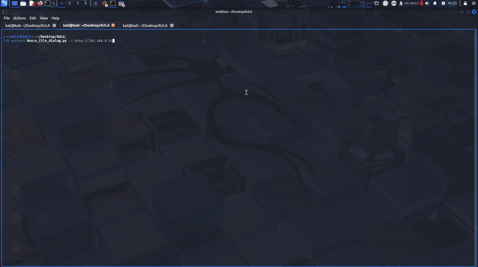
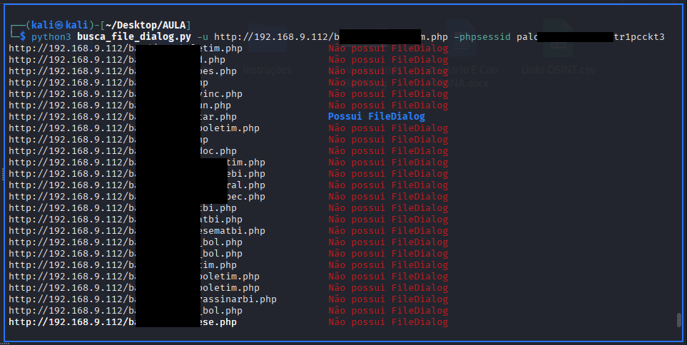

# busca_file_dialog.py
Web Crawler escrito em Python para identificar páginas com FileDialog para upload de arquivos em aplicações Web.
Utilizado para enumeração de páginas com potencial para Local File Inclusion (LFI)



## Descrição
O busca_file_dialog.py procura pela tag input type="file" para identificar se a página tem potencial para fazer upload de arquivos. Caso encontre outros links na página com extensões: .js, .php, .html, .asp  ou .aspx ele verifica a página dos links encontrados recursivamente.

## Uso
```
# Uso simples:
python3 busca_file_dialog -u http://example_url

# Uso com PHPSESSID:
python3 busca_file_dialog -u http://example_url -phpsessid xxxxxxxxx

# Uso com lista de URL em arquivo:
python3 busca_file_dialog -list url_list_filepath
# ou
python3 busca_file_dialog -file url_list_filepath
```

## Parâmetros
```
-u [url] - Informa a URL que será base para a busca por FileDialog

-phpsessid [phpsessid] - Informa o ID de sessão PHP para buscar em aplicação que necessita login

-file [url list]
-list [url list] - Informa caminho do arquivo lista de URL que contém uma URL por linha
```

## Exemplo de uso

